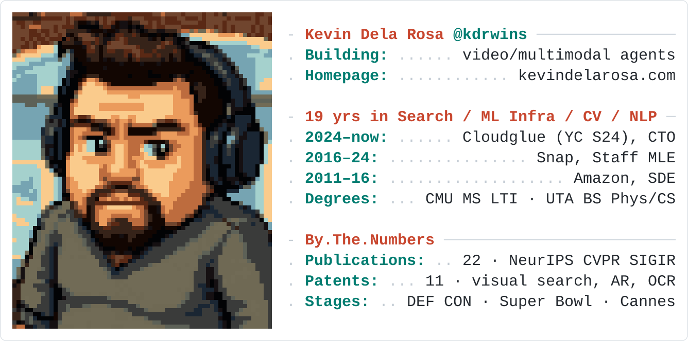

  <picture>
    <source media="(prefers-color-scheme: dark)" srcset="assets/profile-dark.svg">
    
  </picture>

  <strong>Building video context systems for the agentic era.</strong>

  
  
  
  
  
  

---

> ### 📡 Next up — DEF CON 34 Demo Labs
>
> **[Overcast: Video OSINT Agent. Point It at 100 Videos, Ask Anything](https://info.defcon.org/defcon34/content/?id=66515)**
>
> A CLI agent and skill pack that drops into any agentic harness and turns footage into cited evidence — speech, on-screen text, objects, faces, and named entities, all accumulating in persistent case memory.
>
> 🗓️ **Fri Aug 7, 12:00** & **Sat Aug 8, 16:00 PDT** · LVCC Exhibit Hall West 3 (Demo Labs Track 6) · [github.com/kdr/overcast](https://github.com/kdr/overcast)

> ### 🎥 Then — ECCV 2026 Demos
>
> **[Evidence-Grounded Video Investigation over Large Video Corpora](https://eccv.ecva.net/Conferences/2026)**
>
> 🗓️ During the main conference, **Sept 10–12** · Malmö, Sweden

---

### Selected work & talks

- **Autonomous Video Hunter** — AI agents for real-time OSINT · *DEF CON 33 Recon Village* · [watch](https://www.youtube.com/watch?v=oHjQSpcP664)
- **AI That Gets the Picture** — building video-aware assistants · *CascadiaJS 2025* · [watch](https://www.youtube.com/watch?v=7tcdmZ1U90M)
- **MLOps at Snapchat** — continuous ML with Kubeflow and Spinnaker · *KubeCon + CloudNativeCon* · [watch](https://www.youtube.com/watch?v=Sovxz3m2sj0)
- **SageMaker Ground Truth** — building accurate training datasets · *AWS re:Invent 2019* · [watch](https://www.youtube.com/watch?v=6WJxzKsIFKA)

Published at **NeurIPS · AAAI · ICCV · CVPR · WACV · KDD · WWW · CAIS · SIGIR · RecSys · NAACL · ISMIR**
